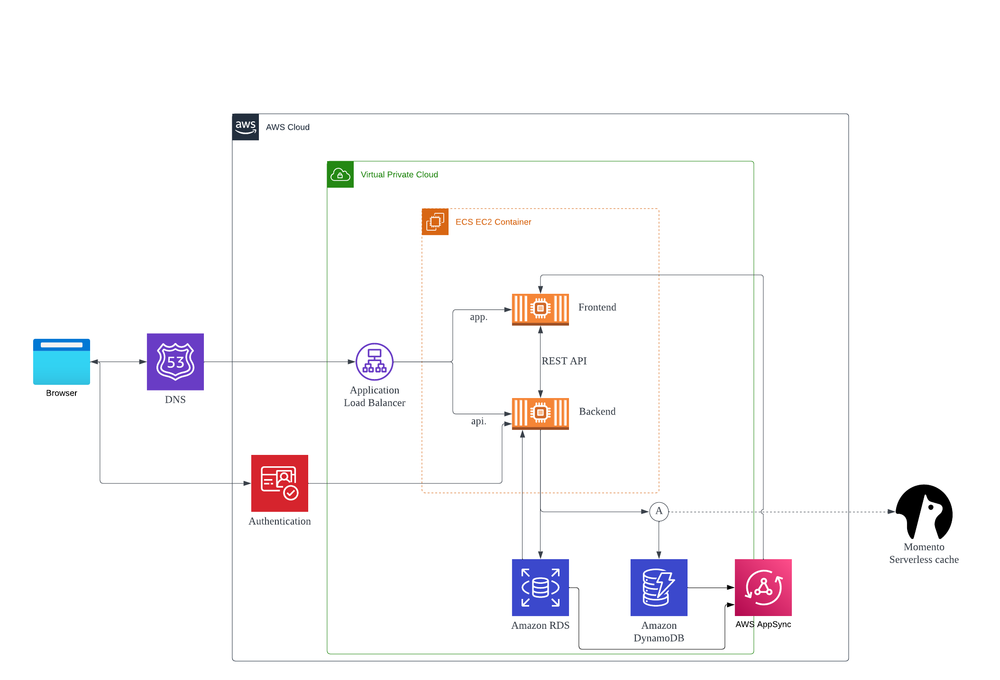

# Week 0 — Billing and Architecture
## Watched all the videos:
Chirag's spending considerations, ashish's security considerations
## Made both the Conceptual Diagram and Architectural Diagram
Architectural Diagram

## Setup the billing alarms and budgets
It is set to send the notification to the email.
Billing Alarm

Budgets

## Account related stuff and CLI setup
made a new IAM user for this project (name is awscloudaccount)
Generated the AWS Credentials and applied it to gitpod and my university pc(that i only use)

gitpod setup

