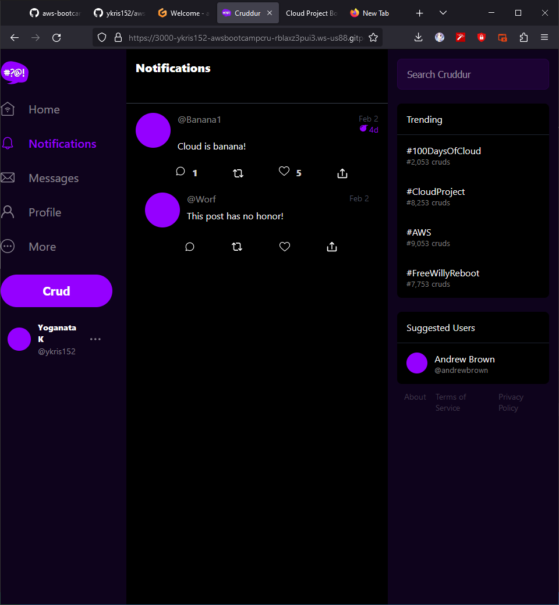
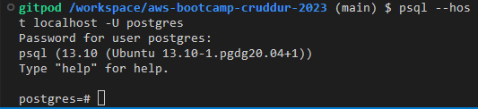
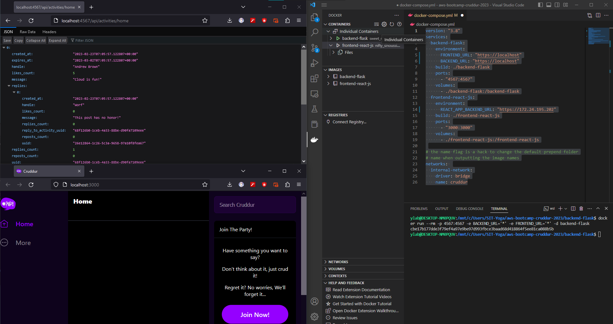

# Week 1 — App Containerization
# Required Work
Watched all the videos and implemented it own repository.

## Implemented my own Notification Page
Notification Page 
 

## Tested postgresql in own gitpod
 

# Homework Challenge
## I tried to run the docker on my own environment
I managed to get the containers working by installing docker desktop on my University PC
Then i followed along the started tutorial to get a better idea of running containers
https://docs.docker.com/get-started/

Next i tried running each container individually (backend and frontend) which they work!
 

But somehow, they don't seem to be able to communicate with each other.
The Posts on the home page is not shown at all.
Furthermore, when i used docker compose up to launch the containers together. The frontend doesn't work.

'''
version: "3.8"
services:
  backend-flask:
    environment:
      FRONTEND_URL: "https://localhost"
      BACKEND_URL: "https://localhost"
    build: ./backend-flask
    ports:
      - "4567:4567"
    volumes:
      - ./backend-flask:/backend-flask
  frontend-react-js:
    environment:
      REACT_APP_BACKEND_URL: "https://localhost"
    build: ./frontend-react-js
    ports:
      - "3000:3000"
    volumes:
      - ./frontend-react-js:/frontend-react-js

# the name flag is a hack to change the default prepend folder
# name when outputting the image names
networks: 
  internal-network:
    driver: bridge
    name: cruddur
'''
This is my docker-compose.yml file.

So my I am troubleshooting it right now.
As a reference i read the article about docker networking introduced. Which really helped me. But i am not still be able to solve the problem. I'll try to work it out this weekend. then maybe i'll try the QA discord
(https://pythonspeed.com/articles/docker-connection-refused/)
