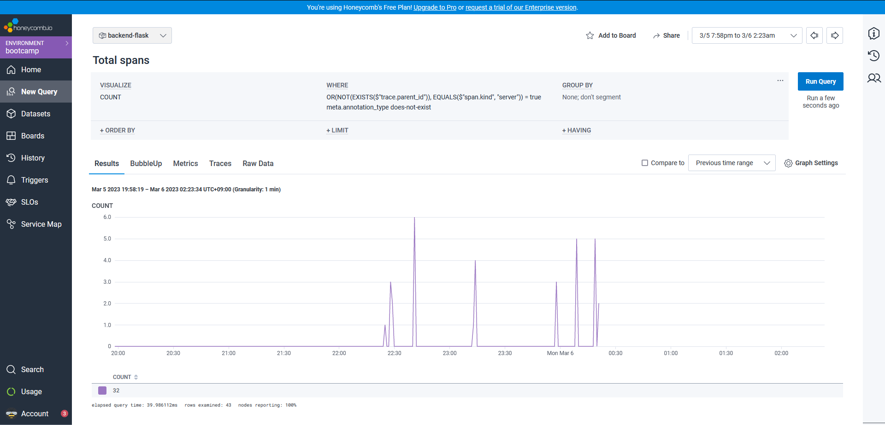
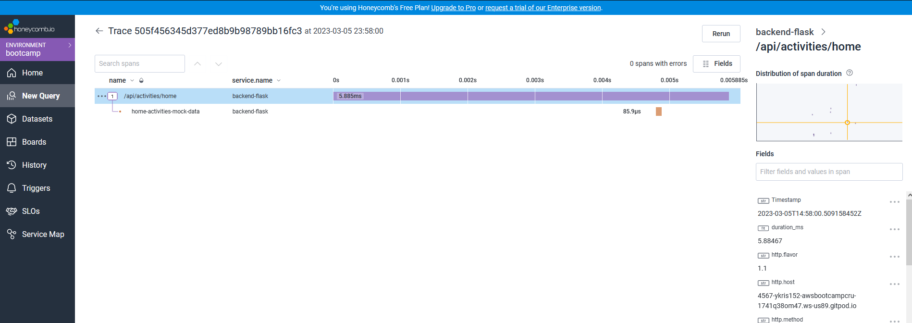
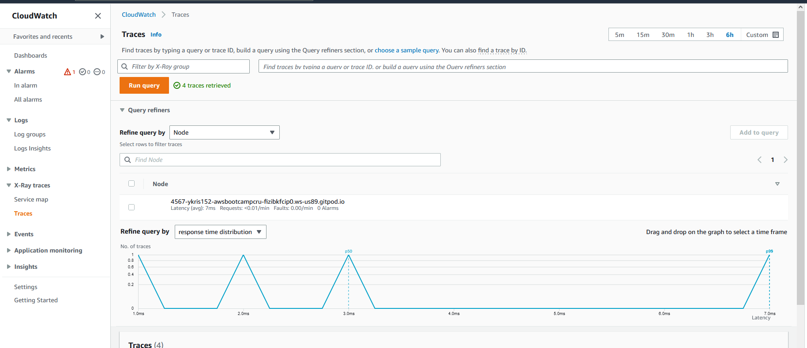
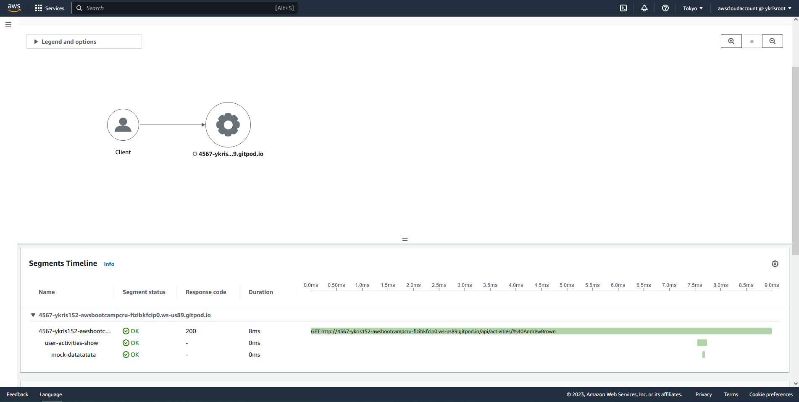
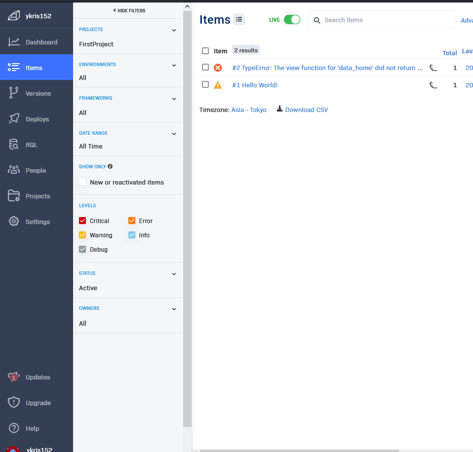

# Week 2 — Distributed Tracing
# Required Work
Watched all the videos and implemented it own repository and watched the cloud role video by Open Up The Cloud. 

## Implemented Honeycomb on my repository
HoneyComb 
 

and tested the traces too.
 

## Implemented X ray and followed along the subsegment's video
 
 

## Tested Error logging with Rollbar
 

# Homework Challenge
Making the cloud role homework (work in progress)