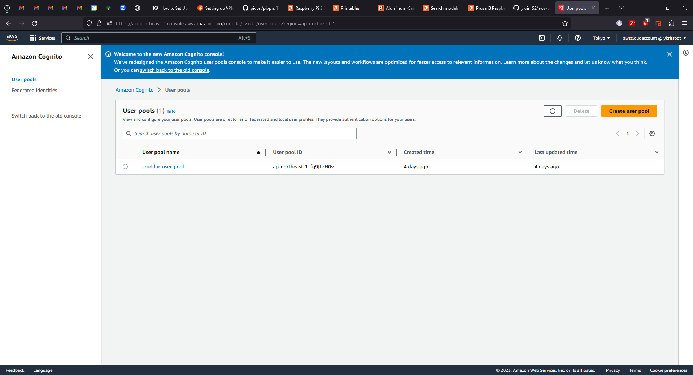
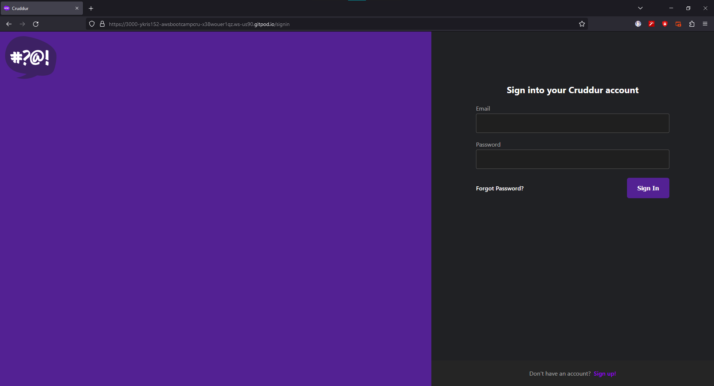
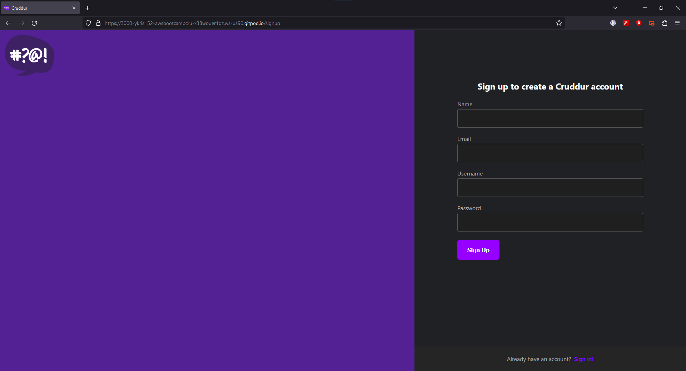
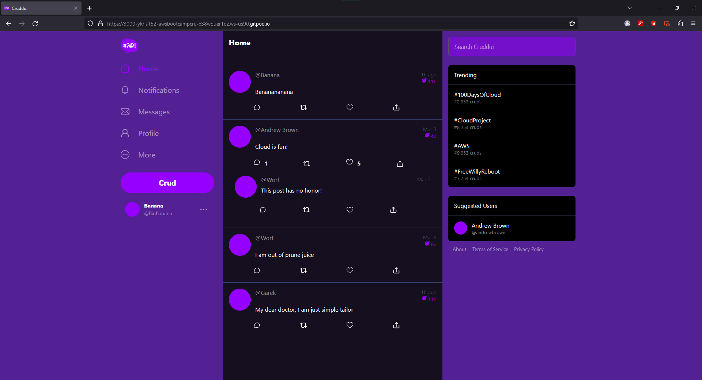
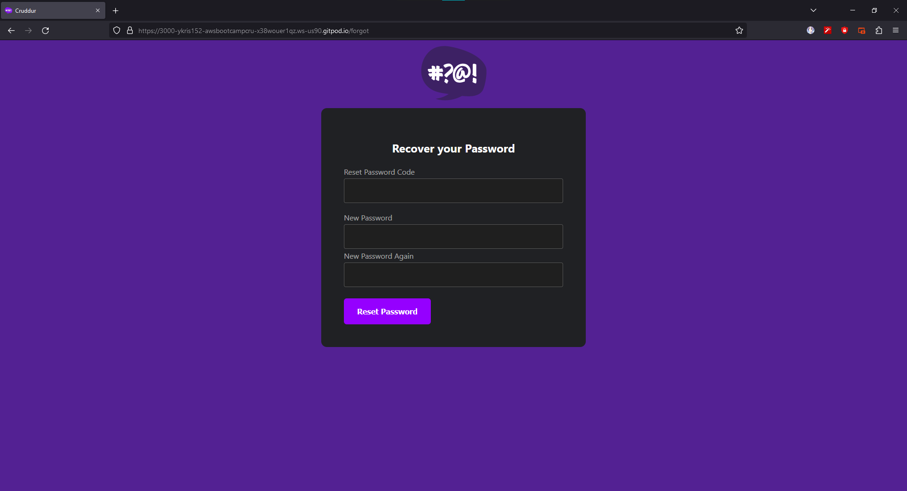
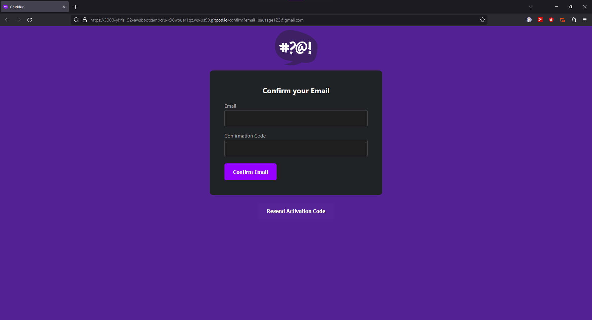

# Week 3 — Decentralized Authentication
# Required Work
Watched all the videos except Spending Consideration.

## Made Cognito User Pool
User Pool 
 

## Changed the UI color and implemented Custom Sign In Page, Sign Up, Signed In, Recovery, Confirmation Page
 
 
 
 
 

# Problem i met during, implementing on my repository.
When trying to implement login and sign in on my repository.
