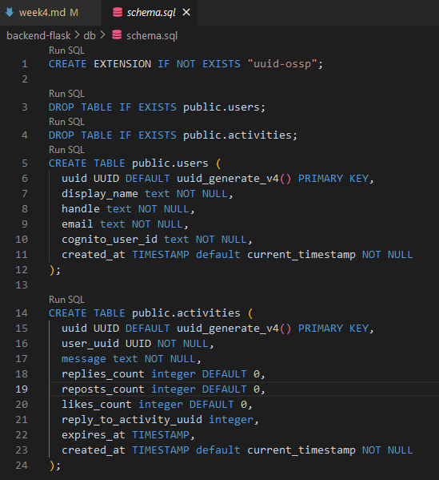
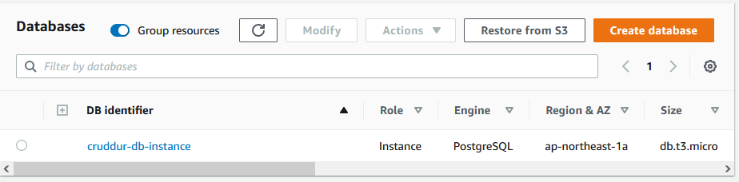
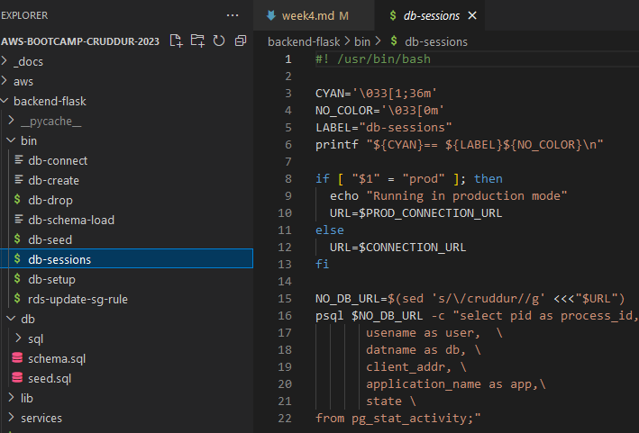
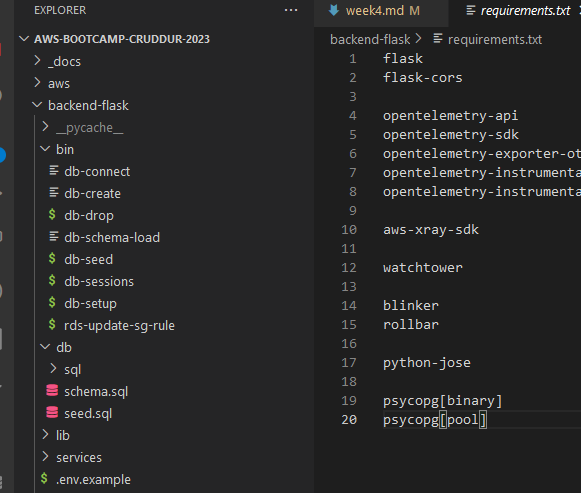
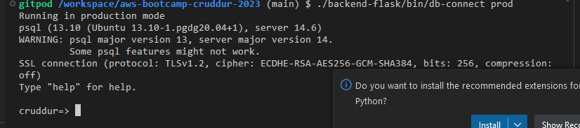
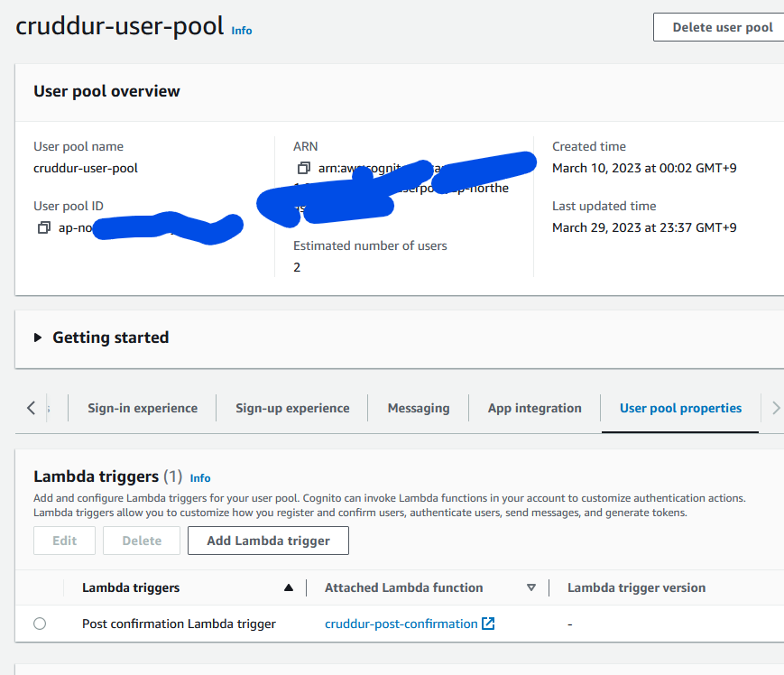
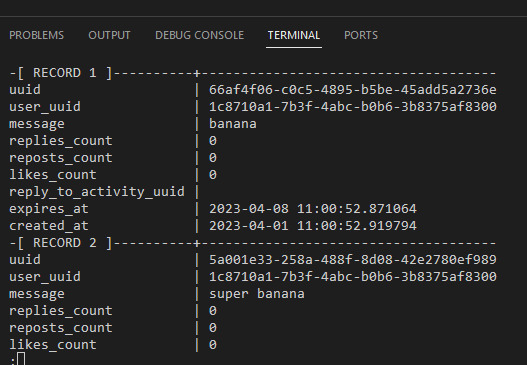

# Week 4 — Postgres and RDS
# Required Work
Watched all the videos except Spending Consideration.

## Schema for Postgres
<br />

## Created RDS Postgres Instance
<br />

## Bash Scripts for db actions
<br />

## Installed Postgres driver in backend
<br />

## Connect gitpod and RDS
<br />

## Cognito trigger lambda
<br />

## Activities registered in db
<br />

# Debugging
When implementing the new activities to db insert i met a problem that says
["null value in column "user_uuid" of relation "activities" violates not-null constrain]
So i followed anle4s's suggestion on discord to change the user handle on HomeFeedPage.js

from
```
user_handle = 'andrewbrown'
```
to

```
user_handle = {user}
```

Then i also changed the ActivityForm.js component to also include the user_handle variable

```
user_handle = request.json["user_handle"]
```

After this changes i checked my db and found that even though my cognito instances have 3 users. my db only have 1 user. so i remade the account by signing up again on my cruddur website. When i confirmed the new users in the db, i compose down everything and compose it up again. Finally i confirmed the problem is solved when i can create new activities(crud).