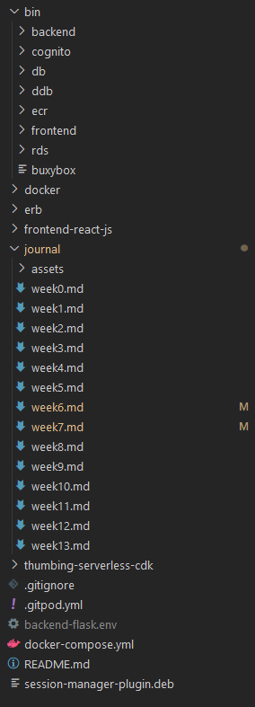

# Week 7 — Solving CORS with a Load Balancer and Custom Domain

## Required Homework:
Watched all the videos and implemented it to own aws account and repository.

### Provision ECS Cluster
ECS-cluster 
 

### Create ECR repo and push image backend-flask & frontend-react-js
ECR Repo 
 

Push backend-flask 
 

Push frontend-react-js 
 

### Deploy Backend-flask & Frontend-react-js as a service to fargate
Register backend-flask task 
 
Register frontend-react-js task 
 

### Provision and configure ALB with target groups
Provision ALB 
 

Target groups 
 

### Create an SSl certificate via ACM
SSL Certificates 
 

### Setup record set for naked domain to frontend-react-js & api subdomain to backend-flask
Records  
 

### Secure Flask by not running in debug mode
Modify the dockerfile to run flask in no-debug mode
'''
CMD [ "python3", "-m" , "flask", "run", "--host=0.0.0.0", "--port=4567", "--no-debug", "--no-debugger", "--no-reload"]
'''

### Refactor bin scripts
Refactor bin files to the top directory
 

### Configure task definitions to contain x-ray & turn on Container Insights
Configure backend task definitions to contain x-ray
 

Configure frontend task definitions to contain x-ray
 

Turn on Container insights
 

### Change Docker Compose to use user-defined network
include the following network settings in all container
'''
networks:
      - cruddur-net
'''

change network configuration in the bottom

'''
networks: 
  cruddur-net:
    driver: bridge
    name: cruddur-net
'''
### Create Dockerfile for production use case
create a new Dockerfile.prod in backend-flask directory
'''
# FROM python:3.10-slim-buster
FROM 938858911474.dkr.ecr.ap-northeast-1.amazonaws.com/cruddur-python:3.10-slim-buster

#for debug stuffs
# RUN apt-get update 
# RUN apt-get install -y iputils-ping

WORKDIR /backend-flask

COPY requirements.txt requirements.txt
RUN pip3 install -r requirements.txt

COPY . .

EXPOSE ${PORT}
CMD [ "python3", "-m" , "flask", "run", "--host=0.0.0.0", "--port=4567", "--no-debug", "--no-debugger", "--no-reload"]
'''

create a new Dockerfile.prod in frontend-react-js directory
'''
# Base Image ~~~~~~~~~~~~~~~~~~~~~~~~~~~~~~~~~~
FROM node:16.18 AS build

ARG REACT_APP_BACKEND_URL
ARG REACT_APP_AWS_PROJECT_REGION
ARG REACT_APP_AWS_COGNITO_REGION
ARG REACT_APP_AWS_USER_POOLS_ID
ARG REACT_APP_CLIENT_ID

ENV REACT_APP_BACKEND_URL=$REACT_APP_BACKEND_URL
ENV REACT_APP_AWS_PROJECT_REGION=$REACT_APP_AWS_PROJECT_REGION
ENV REACT_APP_AWS_COGNITO_REGION=$REACT_APP_AWS_COGNITO_REGION
ENV REACT_APP_AWS_USER_POOLS_ID=$REACT_APP_AWS_USER_POOLS_ID
ENV REACT_APP_CLIENT_ID=$REACT_APP_CLIENT_ID

COPY . ./frontend-react-js
WORKDIR /frontend-react-js
RUN npm install
RUN npm run build

# New Base Image ~~~~~~~~~~~~~~~~~~~~~~~~~~~~~~
FROM nginx:1.23.3-alpine

# --from build is coming from the Base Image
COPY --from=build /frontend-react-js/build /usr/share/nginx/html
COPY --from=build /frontend-react-js/nginx.conf /etc/nginx/nginx.conf

EXPOSE 3000
'''

### ruby script to generate env dot files using erb templates
Ruby scripts (backend - frontend)  
 

erb template for backend
'''
AWS_ENDPOINT_URL=http://dynamodb-local:8000
CONNECTION_URL=postgresql://postgres:password@db:5432/cruddur
FRONTEND_URL=https://3000-<%= ENV['GITPOD_WORKSPACE_ID'] %>.<%= ENV['GITPOD_WORKSPACE_CLUSTER_HOST'] %>
BACKEND_URL=https://4567-<%= ENV['GITPOD_WORKSPACE_ID'] %>.<%= ENV['GITPOD_WORKSPACE_CLUSTER_HOST'] %>
OTEL_EXPORTER_OTLP_ENDPOINT=https://api.honeycomb.io
OTEL_EXPORTER_OTLP_HEADERS=x-honeycomb-team=<%= ENV['HONEYCOMB_API_KEY'] %>
OTEL_SERVICE_NAME:'backend-flask'
AWS_XRAY_URL=*4567-<%= ENV['GITPOD_WORKSPACE_ID'] %>.<%= ENV['GITPOD_WORKSPACE_CLUSTER_HOST'] %>*
AWS_XRAY_DAEMON_ADDRESS=xray-daemon:2000
AWS_DEFAULT_REGION=<%= ENV['AWS_DEFAULT_REGION'] %>
AWS_ACCESS_KEY_ID=<%= ENV['AWS_ACCESS_KEY_ID'] %>
AWS_SECRET_ACCESS_KEY=<%= ENV['AWS_SECRET_ACCESS_KEY'] %>
ROLLBAR_ACCESS_TOKEN=<%= ENV['ROLLBAR_ACCESS_TOKEN'] %>
AWS_COGNITO_USER_POOL_ID=<%= ENV['AWS_COGNITO_USER_POOL_ID'] %>
AWS_COGNITO_USER_POOL_CLIENT_ID=63oijlpq4ufk9rtb6kt5a6b1lg
'''

erb template for frontend
'''
REACT_APP_BACKEND_URL=https://4567-<%= ENV['GITPOD_WORKSPACE_ID'] %>.<%= ENV['GITPOD_WORKSPACE_CLUSTER_HOST'] %>
REACT_APP_AWS_PROJECT_REGION=<%= ENV['AWS_DEFAULT_REGION'] %>
REACT_APP_AWS_COGNITO_REGION=<%= ENV['AWS_DEFAULT_REGION'] %>
REACT_APP_AWS_USER_POOLS_ID=ap-northeast-1_fq9jLzH0v
REACT_APP_CLIENT_ID=63oijlpq4ufk9rtb6kt5a6b1lg
'''